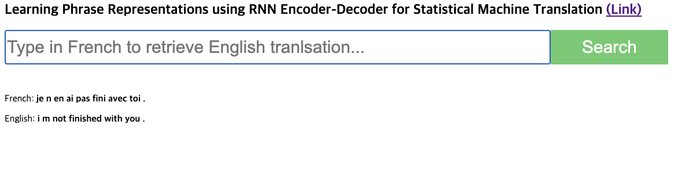

# Learning Phrase Representations using RNN Encoder-Decoder for Statistical Machine Translation 
## https://arxiv.org/abs/1406.1078
## EuiYul Song (20214426)

### Files
* ```main.py```: a main class that preprocess, train, and evaluate the model
* ```vocab.py```: a class that tokenizes and builds vocabulary dictionaries of input and output phrases
* ```encoder.py```: a RNN Encoder with GRU that encodes a sequence of symbols into a fixed-length vector representation 
* ```decoder.py```: a RNN Decoder with GRU that decodes the representation into another sequence of symbols
* ```app.py```: a Flask website that enables users to run French to English translation against this model
* ```Makefile```: a command line automation

### Data
* ```data/eng-fra.txt```: an English to French dictionary (separated by "
\t") that was downloaded from [link](http://www.manythings.org/anki/fra-eng.zip) and refined

### Command
* ```make run```: preprocess, train, and evaluate the model
* ```make app```: run website that translate inputted French phrase to English using this model at ```localhost: 5000```

### Analysis

* BLEU score on the trained dictionary
  * Unigram: 0.99974
  * Bigram: 0.7362
  * Trigram: 0.5625
  * 4-gram: 0.3772
  * Desc: Macroscopically looking at the log and BLEU score, I maintain that my model trained French to English dictionary very well. Thus, I am not going through underfitting problems.  

* Prediction on unseen French word
  * Looking at the website I implemented, it was obvious that this model cannot predict unseen French phrases very well. Thus, this model has overfitting problem. 

### Visualization

* Website at localhost:5000 (refer to Command section)


### Limitation
* Due to time-constraint to complete this project, I was not able to split test and train data for test bleu score. Also, I will add more data, add dropout, or add regularization in order to reduce overfitting. Additionally, I will add t-SNE to visualize my model's embeddings. Lastly, the training phase needs to be fixed, because the training phase stopped working properly after I refactored the code. Thus, it would be my appreciation if you use my checkpoint instead of training my model again.
